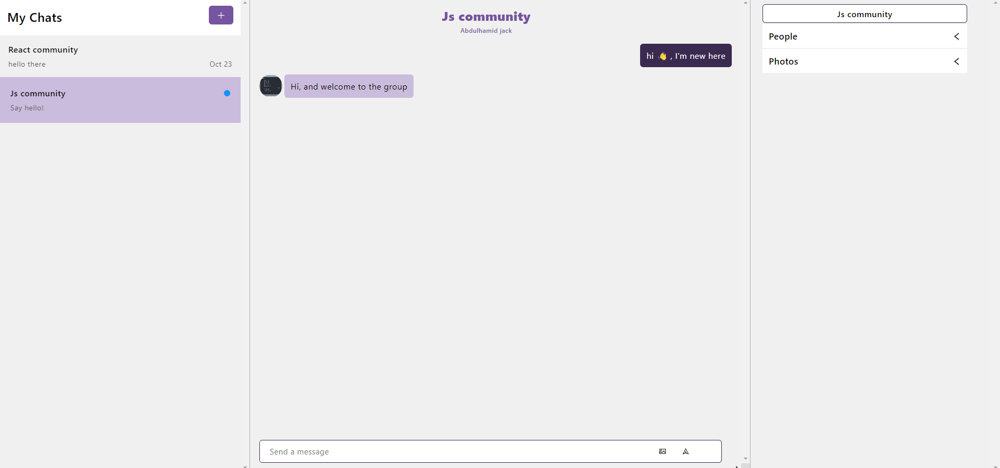
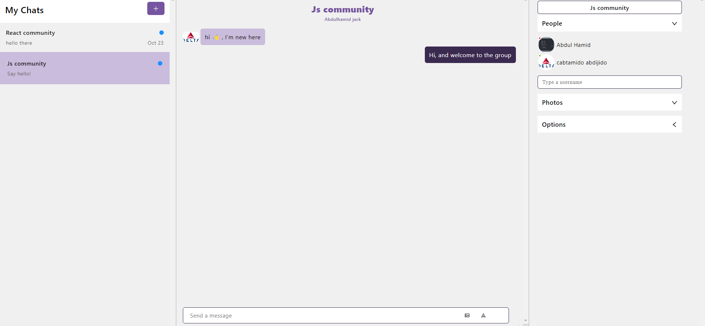

# Chat Application

Welcome to our chat application built with Vite + React! This application allows you to chat with friends and colleagues in real-time. Whether you're looking to have a casual conversation or collaborate on a project, our chat application has got you covered.

## Screenshots

Here are some screenshots of the application:






## Features

- Real-time chat with colleagues.
- User authentication.
- Group chat support.
- Message history and search.
- file attachment support.

## Getting Started

To get started with the chat application, follow these steps:

1. Clone this repository to your local machine.
   ```bash
   git clone https://github.com/your-username/chat-application.git
   ```
2. cd chat-application

3.Start the development server.
npm run dev

# or

yarn dev
#Technologies Used
Vite
React
Happy chatting ☺️!
